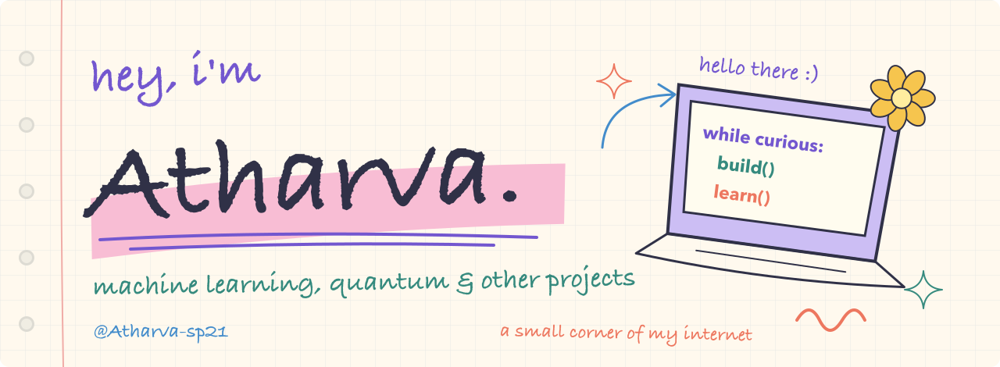
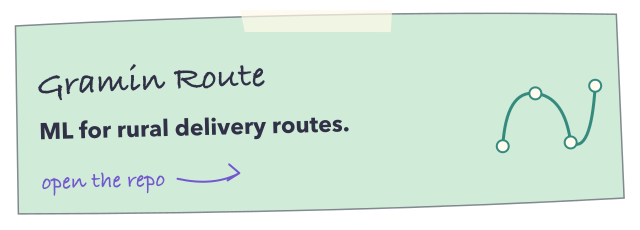
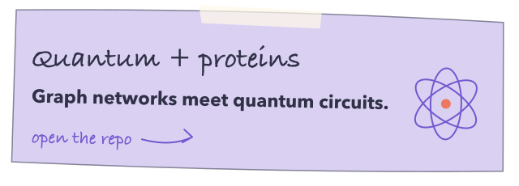
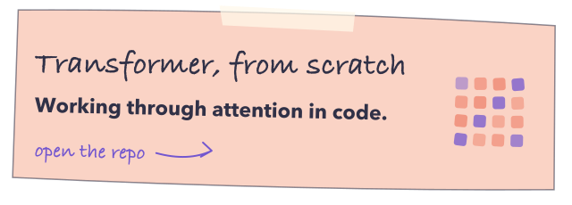
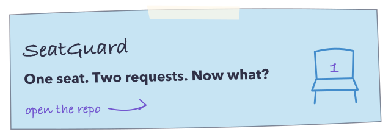

I work on machine learning projects, and I’ve been exploring quantum computing too. This is where I keep the code: models built from scratch, experiments with graphs and audio, and the occasional C++ project.

If something here looks interesting, have a look around :)

## A few things I’ve built

<table>
<tr>
<td width="50%"></td>
<td width="50%"></td>
</tr>
<tr>
<td width="50%"></td>
<td width="50%"></td>
</tr>
<tr>
<td width="50%"></td>
<td width="50%"></td>
</tr>
</table>

[The rest of my repos →](https://github.com/Atharva-sp21?tab=repositories)

## What I’m working on

Recently, I’ve been building a [vehicle-routing research pipeline](https://github.com/Atharva-sp21/gated-quantum-cvrp) with gated quantum bottlenecks. The implementation is there; training and results are still to come.

There’s also a [model-selection project](https://github.com/Atharva-sp21/Policy-Driven-Multi-Model-Inference-System) about choosing between CNNs based on speed, accuracy, or robustness.

## Things I use

**For ML:** Python, PyTorch, NumPy, Pandas, Matplotlib, LangChain. 
**For apps and systems:** FastAPI, React, JavaScript, C++, PostgreSQL, Docker, Git. 
**For blockchain projects:** Solidity, Ethereum, Ethers.js, IPFS.

A couple more projects

- [Voting + budget tracking](https://github.com/Atharva-sp21/decentralized-voting-budget-tracking-system) with Solidity and React.
- [An agent from scratch](https://github.com/Atharva-sp21/Agent_From_Scratch).
- [An image caption generator](https://github.com/Atharva-sp21/Image_Caption_Generator).

 

[LinkedIn](https://www.linkedin.com/in/atharva-shrikant-a2397b31b/) · [Email](mailto:atharva.sp21@gmail.com)
