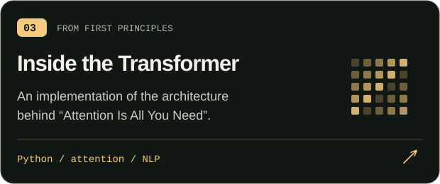
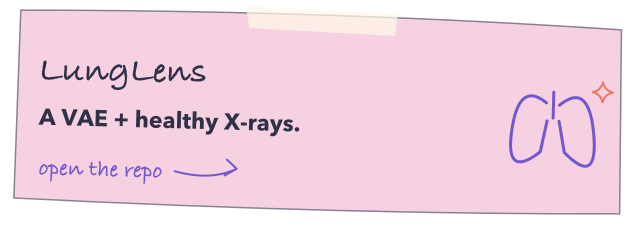

  

  <a href="#selected-experiments"><b>Explore my work</b></a> &nbsp; / &nbsp;
  <a href="#the-workbench"><b>The workbench</b></a> &nbsp; / &nbsp;
  <a href="https://www.linkedin.com/in/atharva-shrikant-a2397b31b/"><b>LinkedIn ↗</b></a>

### Hi, I’m Atharva. I like finding out how things work.

My projects live at the intersection of **machine learning, scientific curiosity, and software systems**. Sometimes that means rebuilding a Transformer from first principles. Sometimes it means exploring quantum graph networks, turning audio into a latent space, or making sure two people can’t book the same seat.

The thread through all of it: **ask an interesting question, build something concrete, and examine what happens.**

---

## Selected experiments

Six entry points into the lab. **Click a card to open the code.**

<table>
<tr>
<td width="50%"></td>
<td width="50%"></td>
</tr>
<tr>
<td width="50%"></td>
<td width="50%"></td>
</tr>
<tr>
<td width="50%"></td>
<td width="50%"></td>
</tr>
</table>

<a href="https://github.com/Atharva-sp21?tab=repositories"><b>Wander through all repositories →</b></a>

## Three questions I keep coming back to

| Intelligence | Structure | Reliability |
| :--- | :--- | :--- |
| **What did the model actually learn?** | **What changes when geometry becomes part of the model?** | **What happens when the system is under pressure?** |
| Attention, generative models, anomaly detection, and inference policies. | Equivariant networks, graph learning, and quantum–classical architectures. | Concurrency, routing pipelines, transparent governance, and APIs. |

## On the bench

**[Gated quantum CVRP →](https://github.com/Atharva-sp21/gated-quantum-cvrp)**

A reproducible vehicle-routing research pipeline combining POMO/PPO with gated quantum latent bottlenecks, fixed datasets, and ablation tools. **Implementation stage; training results are still ahead.**

**[Policy-driven model inference →](https://github.com/Atharva-sp21/Policy-Driven-Multi-Model-Inference-System)**

Exploring how a system chooses between CNN models when speed, accuracy, and robustness pull in different directions.

## The workbench

| What I’m working with | Tools |
| :--- | :--- |
| **Models & data** | Python · PyTorch · NumPy · Pandas · Matplotlib · LangChain |
| **Research directions** | Transformers · graph neural networks · VAEs · quantum machine learning |
| **Apps & services** | FastAPI · JavaScript · React · HTML/CSS · Streamlit · n8n |
| **Systems & storage** | C++ · PostgreSQL · MySQL · Docker · Git |
| **Decentralized systems** | Solidity · Ethereum · Ethers.js · IPFS |

<b>A few more rabbit holes</b>

 

- **[Decentralized governance](https://github.com/Atharva-sp21/decentralized-voting-budget-tracking-system)** — voting and phase-gated budget tracking with Solidity and React.
- **[An agent from scratch](https://github.com/Atharva-sp21/Agent_From_Scratch)** — exploring LLM agents through code.
- **[Image captioning](https://github.com/Atharva-sp21/Image_Caption_Generator)** — another way to connect pixels and language.

 

  <a href="https://www.linkedin.com/in/atharva-shrikant-a2397b31b/"><b>LinkedIn</b></a> &nbsp; · &nbsp;
  <a href="mailto:atharva.sp21@gmail.com"><b>Email me</b></a> &nbsp; · &nbsp;
  <a href="https://github.com/Atharva-sp21?tab=repositories"><b>Browse the lab</b></a>

Built with curiosity. Explained through code.

